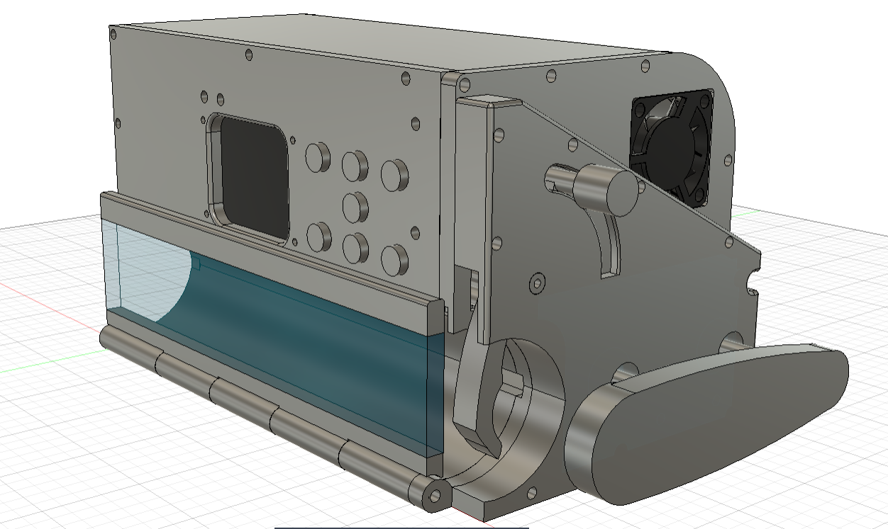
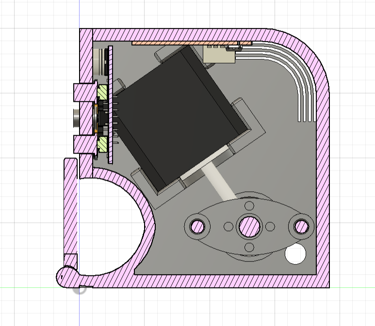
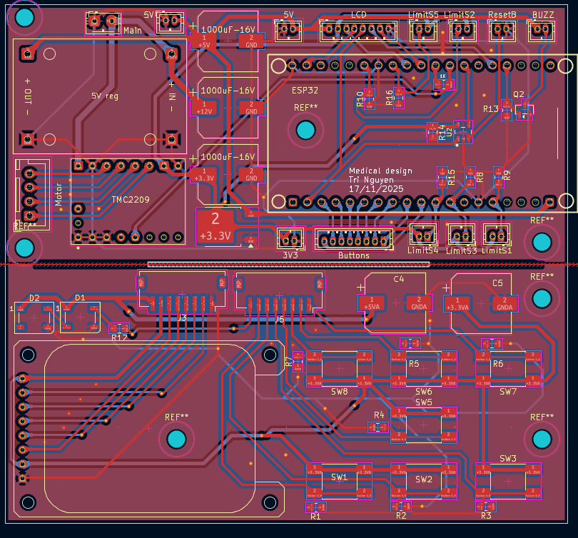
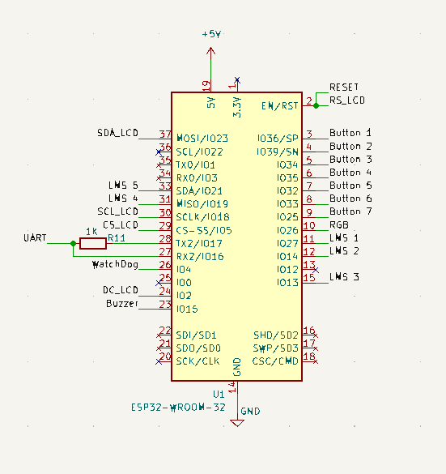
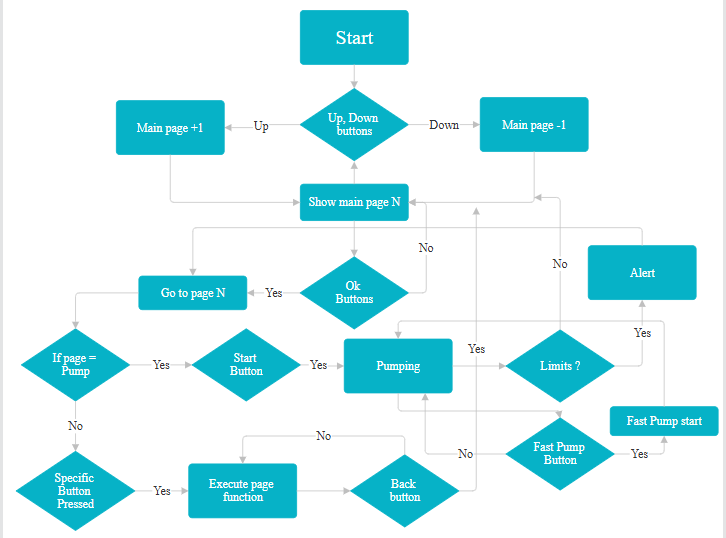
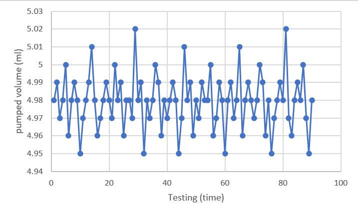

# Precision Syringe Pump System (ESP32 + TMC2209)

## 📖 Overview
This project is a medical-grade automated syringe pump designed for high-precision fluid delivery in laboratory and clinical settings. Developed as part of the **Medical Design Course** at the **School of Biomedical Engineering, International University (VNU-HCM)**, the system focuses on resolving common intravenous administration errors through automation and safety monitoring.

The device utilizes an **ESP32 microcontroller** and **TMC2209 SilentStepStick driver** to achieve a verified dosing accuracy of **99.62%**. It features a custom 3D-printed enclosure, a real-time TFT display interface, and a closed-loop safety system.

*The complete design of Syringe pump machine*

## ✨ Key Features
* **High Precision:** Volumetric accuracy of **99.62%** with a standard deviation of **±0.012 mL** (verified via gravimetric testing).
* **Wide Flow Range:** Capable of flow rates from **0.1 mL/h to 1500 mL/h**.
* **Silent Operation:** Utilizes TMC2209 drivers with **StealthChop** technology for vibration-free fluid delivery.
* **Advanced Safety:**
    * **Soft Start Algorithm:** Prevents motor stalling by gradually ramping velocity during startup.
    * **RPM Limiting:** Firmware Hard Limit prevents speeds exceeding 50 RPM to protect mechanics.
    * **Hardware Interlocks:** Dual limit switches and clamp sensors to detect mechanical faults.
* **User Interface:** 1.69-inch IPS TFT display for real-time monitoring and parameter adjustment.

## 🛠 System Architecture

### Hardware Components (BOM)
The system is built around the following key components:
| Component | Specification | Role |
| :--- | :--- | :--- |
| **MCU** | ESP32-WROOM-32 | Central processing and logic control |
| **Driver** | TMC2209 | UART-controlled stepper driver (SilentStepStick) |
| **Motor** | NEMA 17 Stepper | 1.8° step angle, 200 steps/rev |
| **Transmission** | T8 Lead Screw | 2mm pitch, direct coupling (1:1 ratio) |
| **Display** | 1.69" ST7789 TFT | User interface and status display |
| **Power** | MP2482 Buck Converter | Steps down 12V to 5V for power |
| **Power** | LM1085 | Steps down 5V to 3.3V for logic |
| **Safety** | TPS3823-33 | Watchdog timer for system reliability |

### Mechanical Design
The chassis is 3D printed and features a **rigid linear guide system**:
* **Structure:** Stainless steel guide rods and LM5UU linear bearings ensure alignment.
* **Mechanism:** Direct drive via T8 lead screw converts rotational motion to linear displacement.
* **Enclosure:** Includes a syringe clamp, transparent trap door, and integrated cooling fan for the driver.

*The inside structure of Syringe pump machine*

## 🔌 PCB & Electronics Design

The electronics are consolidated onto 2 custom-designed 2-layer PCB pieces to minimize wiring complexity and ensure signal integrity.

Custom PCB Layout featuring ESP32 and TMC2209 driver integration*

### Key Circuit Features
* **Power Regulation:** Steps down 12V input to 5V (MP2482) and 3.3V (LM1086) to power logic components stably.
* [**Driver Integration:** Onboard TMC2209 stepper driver with UART communication for dynamic current control and micro-stepping configuration.
* **Safety Circuitry:** Integrated **TPS3823 Watchdog Timer** to automatically reset the MCU if voltage irregularities or firmware hangs occur.
* **Peripherals:** Dedicated ports for Limit Switches, I2C LCD, and active cooling fan control.

## 💻 Firmware & Pinout

The firmware is written in C++ (Arduino Framework) and utilizes a **Finite State Machine (FSM)** to manage operations safely.

### Wiring Configuration
Based on `Main.ino` and PCB Schematics:

| ESP32 GPIO | Function | Description |
| :--- | :--- | :--- |
| **16 (RX) / 17 (TX)** | UART | Communication with TMC2209 Driver |
| **5 (CS) / 2 (DC)** | SPI | ST7789 TFT Display Control |
| **21** | Limit Switch | Driver Max Position (Extended) |
| **14** | Limit Switch | Driver Min Position (Retracted) |
| **19** | Sensor | Syringe Clamp/Trap Detection |
| **15** | Output | Buzzer for Audible Alerts |
| **25** | Output | NeoPixel RGB LED Status |
| **36** | Input | Start/Stop Button |
| **35, 33, 34, 32, 36, 39, 26** | Input | Navigation Buttons (Right, Left, Up, Down, Start/Stop, Clear, OK) |

*The schematic of Microcontroler ESP32 of the system*

## 📂 Firmware Source Code

The core logic for the device is contained in the **`Main.ino`** file. This code implements the Finite State Machine (FSM), TMC2209 UART driver control, and the TFT user interface.

👉 **[View Source Code (Main.ino)](./Main.ino)**

### Key Code Modules:
* [cite_start]**Pin Definitions:** GPIO mappings for ESP32, including limit switches and sensors [cite: 344-346].
* [cite_start]**Safety Logic:** Implementation of `MAX_RPM_LIMIT` and `updateMotorLogic()` for error handling[cite: 349, 435].
* [cite_start]**FSM Implementation:** State management for `PAGE_RUNNING`, `STATE_PUMPING`, and `STATE_ERROR` [cite: 352-353].

### Logic Flow
## Generally having three steps:
1.  **Homing Sequence:** Upon boot, the system executes `runHomingSequence()`, utilizing a custom acceleration ramp to retract the pusher block safely.
2.  **Infusion Calculation:** `startInfusion()` calculates the required motor RPM based on syringe diameter and target flow rate. It aborts if RPM > `MAX_RPM_LIMIT`.
3.  **Operation:** The system enters `STATE_PUMPING`, continuously monitoring `updateMotorLogic()` for limit switch triggers or completion events.

*The complete flow chart of the system*

## 📊 Validation & Results

The system underwent rigorous testing using a gravimetric method (distilled water density ≈ 1.00 g/mL).

* **Test Protocol:** 95 consecutive cycles of 5 mL delivery.
* **Results:**
    * **Mean Volume:** 4.981 mL
    * **Accuracy:** 99.62% (0.38% under-delivery)
    * **Precision:** Standard Deviation ±0.012 mL

*Consistency results over 95 continuous pumping cycles*

## 🚀 Installation & Usage

1.  **Dependencies:** Install the following libraries in Arduino IDE or PlatformIO:
    * `Adafruit_GFX`
    * `Adafruit_ST7789`
    * `TMCStepper`
    * `Adafruit_NeoPixel`
2.  **Configuration:**
    * Connect the hardware according to the pinout table.
    * Upload `Main.ino` to the ESP32.
3.  **Operation:**
    * Power on the device (12V DC).
    * Wait for the "Auto Loading" homing sequence to complete.
    * Use the **Settings** menu to define Syringe Diameter and Flow Rate.
    * Select **Start Run**.

## ⚠️ Known Limitations
* **One-Way Operation:** Current mechanical design supports infusion (pushing) only, not withdrawal.
* **LED Logic:** In current firmware version v1.0, the LED color logic may be inverted (Green for Stop, Yellow for Run) compared to standard safety protocols.

## 👥 Contributors
* **Nguyen Tan Tri - BME - K23**

## 📄 Purpose of publish
This project is open-source for educational and research purposes.

---
*The device is the final project for Medical Design course of Biomedical Engineering department, International University VNU-HCMC*
